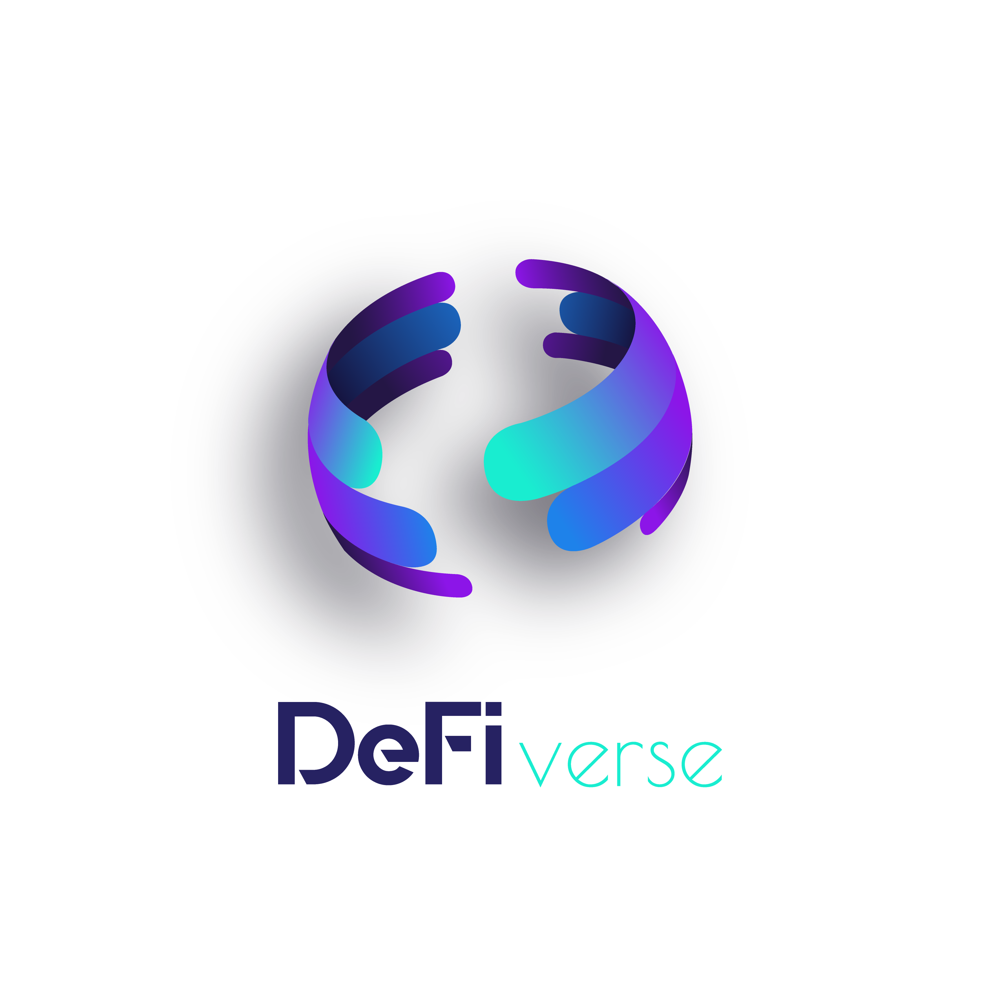

<h1 align="center">
  

  
 
</h1>

## Patrons

> " For DeFi lovers. Doing it the Aave way."

> Patrons aim to build a ecosystem, where everyone grant and become part of the project without paying anything from their project. 

## Table of contents
* [General info](#general-info)
* [Screenshots](#screenshots)
* [Technologies](#technologies)
* [Setup](#setup)
* [Features](#features)
* [Status](#status)
* [Inspiration](#inspiration)
* [Contact](#contact)

## General info

The patrons can show their love for the open source projects by sharing the interest generated by Aave's lending protocol.
It leverages the interest bearing feature of aTokens, and wide variety of underlying assets in the Aave protocol which provides
flexibility and encourages a larger audience to become one of us. 

## Screenshots

## Technologies
* Aave Protocol 
* rDAI 
* Compound Finance

## Setup

## Code Examples
Show examples of usage:
`put-your-code-here`

## Features

* rDAI - reedemable money, which tokenizes different assests into a single interest token "rDAI"
* User have option of multiple tokens, to contribute with...
* It supports two lending protocols, Aave and Compound. 

To-do list:

* Make a user dashboard, where user can manage multiple hats. 
* DAO which will recognize the contributors on certain levels.

## Status
Project is: _in progress_

## Inspiration
Project inspired by rDAI.

## Creators
* [@CryptoCrat](https://twitter.com/CryptoCrat7) 
* [@rekspero](https://twitter.com/CryptoCrat7) 
- feel free to contact us!
